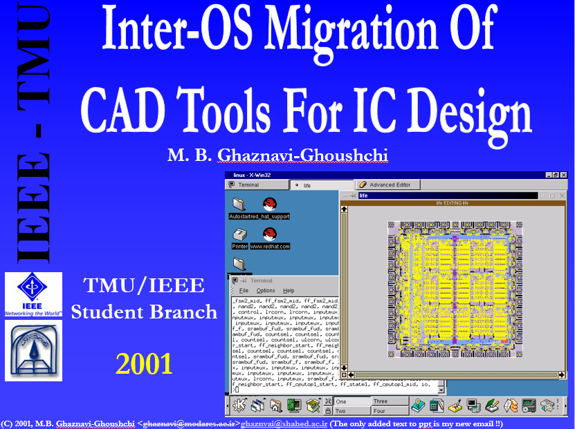

# Inter-OS Migration Of CAD Tools For IC Design

By [M. B. Ghaznavi-Ghoushchi](https://github.com/ghoushchi).

This is a presentation from 2001 on mostly-open-source tools and related languages with Inter-OS migration in mind. No bit is changed in the original 2001 draft but my recent email. 

It is a glimpse of time from 2001 on status of tools and languages that are now in front-line of 
Free Open-Source Software (FOSS) Movement from Inter-OS migration viewpoints. 
Looking back shows how the open-source tools are matured during the years.
A presention from my student days in TMU/IEEE students branch.
Thanks to TMU EECS department for supporting me during that fantastic days!

Link to file:

#Magic #tcl #tk #perl #Java #design_flow #ICdesign #CAD #EDA #opensource #open_source #FOSS
#IEEE #TMU 

### Credits:
All the credits are related to corresponding tools and vendors.

# Related Projects
Please follow us to be informed about related projects:

<a href="https://github.com/yarpose" rel="nofollow noreferrer">
     YARPOSE - A Dejavu project in EDA
  </a> 
  <a href="https://www.linkedin.com/in/ghaznavi-ghoushchi" rel="nofollow noreferrer">
     M. B. Ghaznavi-Ghoushchi
  </a> &nbsp; 
  <a href="https://github.com/ghoushchi" rel="nofollow noreferrer">
     ghoushchi
  </a>

